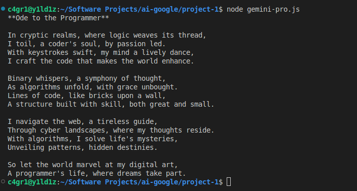

# Gemini Pro Content Generation

This application uses Google Generative AI to generate content based on a given prompt.

## Prerequisites

- Node.js installed
- `dotenv` package installed
- `@google/generative-ai` package installed
- `node-fetch` package installed

## Installation

1. Install the required packages:

    ```
    npm install dotenv @google/generative-ai node-fetch
    ```

2. Create a `.env.local` file with your Google Generative AI API key:

    ```
    API_KEY=your_api_key_here
    ```

## Usage

1. Ensure you are in the project directory.

2. Run the application:

    ```
    node gemini-pro.js
    ```

## Code Explanation

- **dotenv:** Loads environment variables from a `.env.local` file.
- **GoogleGenerativeAI:** The class used to interact with Google Generative AI.
- **fetch:** The global `fetch` function provided by `node-fetch`.

The script sends a prompt to the AI model and prints the generated content to the console.

### Example Outputs

#### Output


