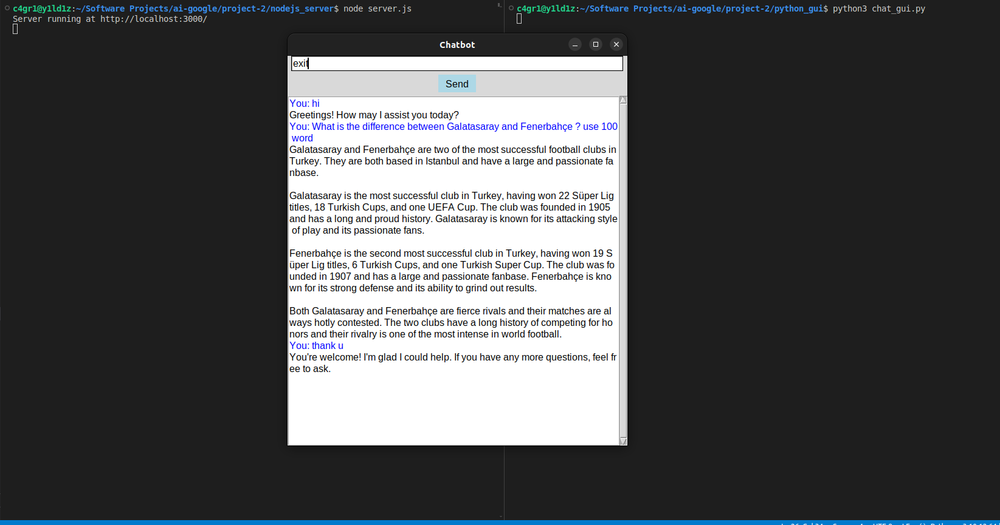

# Chatbot Application with Node.js Server and Tkinter GUI

This application consists of a Node.js server that uses Google Generative AI to generate responses and a Tkinter-based Python GUI that interacts with the server.

## Prerequisites

### Node.js Server

- Node.js installed
- `dotenv` package installed
- `@google/generative-ai` package installed
- `node-fetch` package installed

### Python GUI

- Python 3.x installed
- `requests` package installed
- `tkinter` package (usually included with Python installations)

## Installation

### Node.js Server

1. Install the required packages:

    ```bash
    npm install dotenv @google/generative-ai node-fetch
    ```

2. Create a `.env.local` file with your Google Generative AI API key:

    ```plaintext
    API_KEY=your_api_key_here
    ```

3. Create a file named `server.js` and add your server code.

### Python GUI

1. Install the `requests` package if you don't have it:

    ```bash
    pip install requests
    ```

2. Create a file named `chatbot_gui.py` and add your GUI code.

## Usage

### Node.js Server

1. Ensure you are in the project directory.

2. Start the Node.js server:

    ```bash
    node server.js
    ```

### Python GUI

1. Run the Python GUI:

    ```bash
    python chatbot_gui.py
    ```

## Functionality

- **Node.js Server:** Receives POST requests, interacts with Google Generative AI, and sends back responses.
- **Python GUI:** Provides a user interface for chatting with the AI. Users can send messages, clear the chat, or exit the application.

## Example

1. Start the Node.js server.
2. Run the Python GUI.
3. In the GUI, type a message and click "Send" or press Enter.
4. The server processes the message using Google Generative AI and responds. The response is displayed in the GUI text area.

## Notes

- Ensure the Node.js server is running before starting the Python GUI.
- The GUI can send messages to the server, and responses will be displayed in the GUI text area.

### Example Outputs

#### Output

