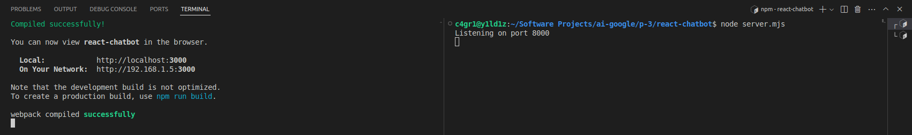
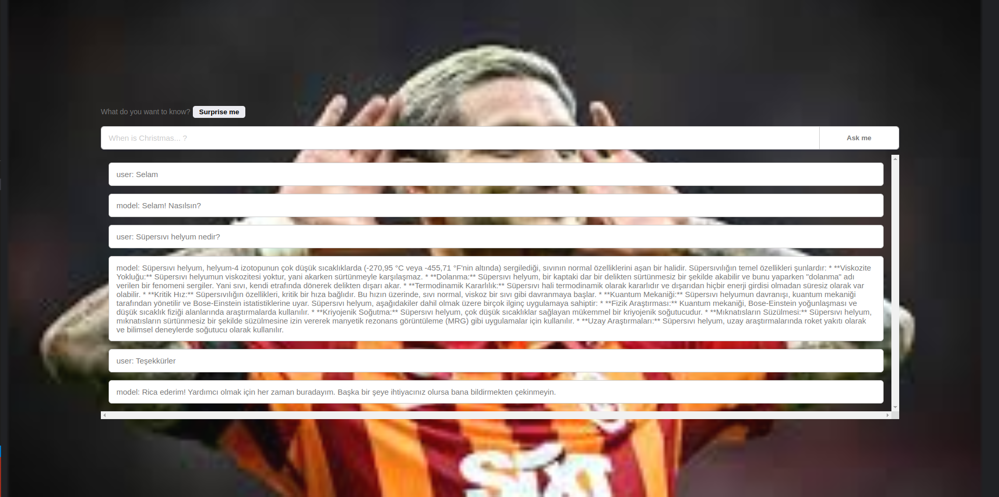

# React Chatbot with Google Generative AI

This project is a React-based chatbot application that uses the Google Generative AI API for generating responses. The backend is built with Node.js and Express, and it communicates with the Google Generative AI service to handle chat interactions.

## Project Structure

The project has the following structure:

- `node_modules/`: Contains the installed Node.js packages.
- `public/`: Contains the public assets for the React application.
- `src/`: Contains the source code for the React application, including `App.js`, `index.css`, and `index.js`.
- `.env.local`: Contains environment variables, specifically the Google Generative AI API key.
- `package.json`: Lists the project dependencies and scripts.
- `README.md`: The readme file you are currently reading.
- `server.mjs`: The backend server file.

## Setup and Installation

### Prerequisites

- Node.js (version 14 or higher)
- npm (Node Package Manager)

### Steps

1. **Clone the repository**: Download the project files from the repository to your local machine.

2. **Install dependencies**: Install the necessary Node.js packages listed in `package.json`.

    - npm install

3. **Set up the environment variables**: Create a file named `.env.local` in the root directory of the project and add your Google Generative AI API key to it.

    - API_KEY=your-google-generative-ai-api-key

## Running the Application

### Start the Node.js Server

    - node server.mjs

Run the command to start the backend server. This server will handle POST requests at the `/gemini` endpoint, process messages, and return responses generated by the Google Generative AI API.

### Start the React Application

In another terminal, navigate to the project root directory and run:

    - npm start

Run the command to start the React development server. This server will open the application in your default web browser.

## Project Details

### Backend (server.mjs)

The backend is a Node.js server using Express. It handles incoming POST requests containing chat messages, processes these messages using the Google Generative AI API, and sends back AI-generated responses.

### Frontend (src/App.js)

The frontend is built with React. It provides a user interface where users can input messages, view responses from the AI, and clear the chat history. The frontend communicates with the backend server to get AI-generated responses.

### Example .env.local File

An example `.env.local` file should contain your Google Generative AI API key.

## Usage

1. **Ask a question**: Users can type a question in the input field and send it to the AI for a response.
2. **Surprise me**: The application can suggest random questions for the user to ask.
3. **Clear the chat**: Users can reset the chat history to start a new conversation.

### Example Outputs

#### Output

